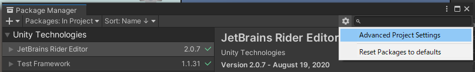
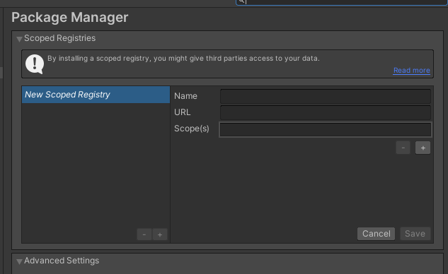
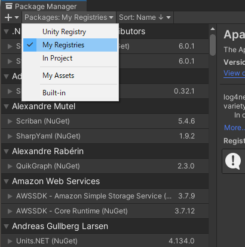
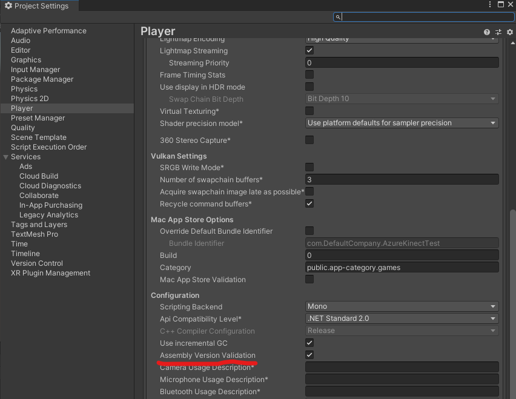

# Azure KinectのUnityでの点群表示まで(Direct3D11対応)
## 環境
- Unity 2020.3.35f1
- Azure Kinect SDK v1.4.1

## Unity Project 設定
- Unity プロジェクト作成後 UPM にて必要なパッケージを導入します。
- Package Manager の右上の歯車マークから Advanced Project Settings を選択
    

- Scoped Registry の以下の項目を追加して Save する
    - Name : Unity NuGet
    - URL : https://unitynuget-registry.azurewebsites.net
    - Scope(s) : org.nuget
    - 

- Package Manager を開きなおすと Packages: に My Registries が追加されています。
    

- My Registries から以下をインストールします。
    - Microsoft.Azure.Kinect.Sensor (NuGet)

- UPMインポート後 System.Memory のdllのバージョンエラーが発生します。
    - Unity 内部が持っている dll と UPM が必要としている dll のバージョンが異なるため発生しています。

- Project Settings の Player の Configuration の Assembly Version Validation のチェックを外すことで解消できます。
    

## Azure Kinect の点群表示設定
- Azure Kinectのコントロールと点群表示のためのサンプルプロジェクトが準備しています。
- サンプルで点群と簡易的なメッシュ表示に対応しています。

## Direct3D11対応
- Graphics APIs for WindowsがDirect3D11の場合、メッシュ内の設定から行える点群表示での点群サイズの変更が行えません。
    - Project Settings -> Player -> Other Settings -> Rendering から変更が可能です。
    - OpenGLES3に変更することで点群サイズの変更は行えます。
- Direct3D11の状態で点群のサイズを変更したかったため、点群を平面メッシュに変換して表示するようにしています。
